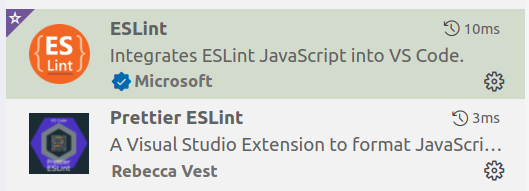

# 参与开发

- Danke 假设开发者都是在 VSCode 下进行开发。

- 目前项目中加入了 ESLint，请在 VSCode 中下载 ESLint 的两款插件，使得每次保存当前编辑文件时自动 lint。

  

- Danke 通过 TypeORM 与数据库交互，相关配置可见 `src/utils/config.ts`。为了能正常连接数据库，请参考如下流程。

  ```
  sudo mysql # 进入数据库
  CREATE USER 'pink'@'localhost' IDENTIFIED BY 'password'; # 创建一个新的用户 pink，密码为 password
  FLUSH PRIVILEGES;
  CREATE DATABASE pink; # 创建 pink 数据库
  GRANT ALL PRIVILEGES ON `pink` . * TO 'pink'@'localhost'; # 将 pink 数据库的所有权限开放给用户 pink
  FLUSH PRIVILEGES;
  ```

  